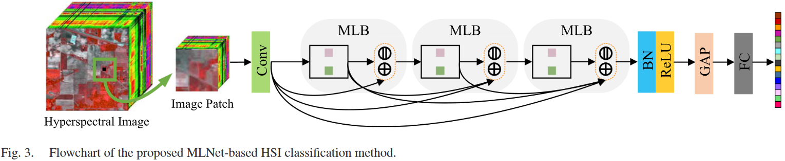
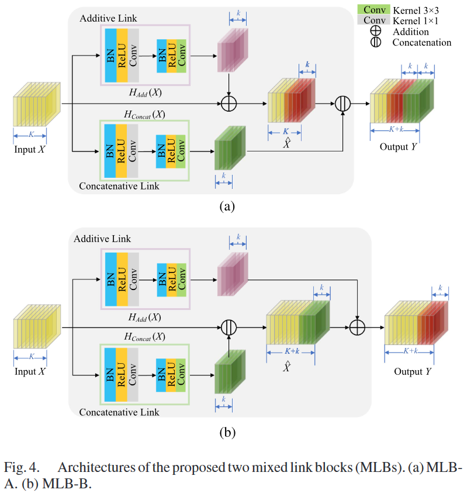
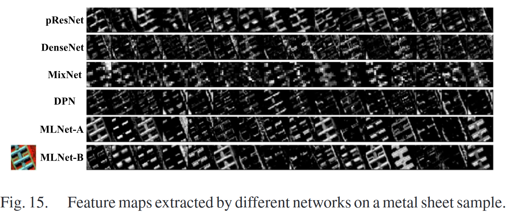

# DMLN

PyTorch implementation of hyperspectral image classification with mixed link networks.





# Basic Usage

```
model = DMLN(num_classes=16, channels=200)
model.eval()
print(model)
input = torch.randn(100, 200, 11, 11)
y = model(input)
print(y.size())
```

# Paper

[Hyperspectral image classification with mixed link networks](https://ieeexplore.ieee.org/abstract/document/9335013)

Please cite our paper if you find it useful for your research.

```
@article{meng2021hyperspectral,
  title={Hyperspectral image classification with mixed link networks},
  author={Meng, Zhe and Jiao, Licheng and Liang, Miaomiao and Zhao, Feng},
  journal={IEEE Journal of Selected Topics in Applied Earth Observations and Remote Sensing},
  volume={14},
  pages={2494--2507},
  year={2021},
  publisher={IEEE}
}
```

# Acknowledgment

This code is partly borrowed from [Mixed Link Networks](https://github.com/DeepInsight-PCALab/MixNet).
